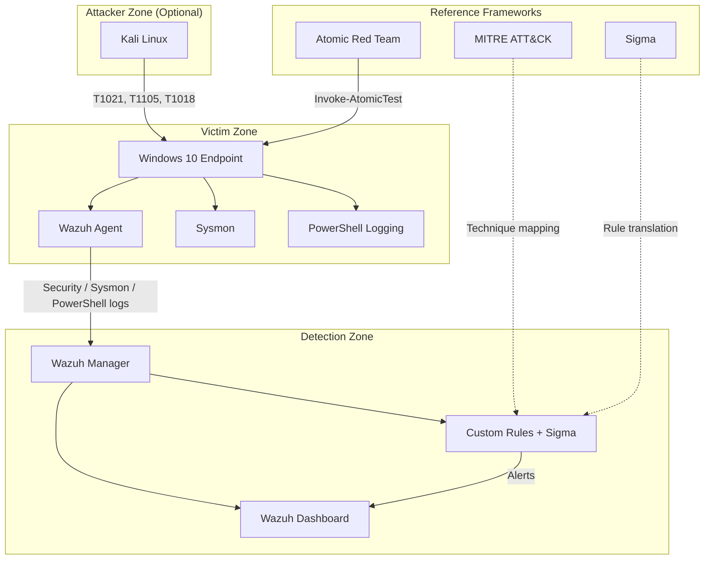
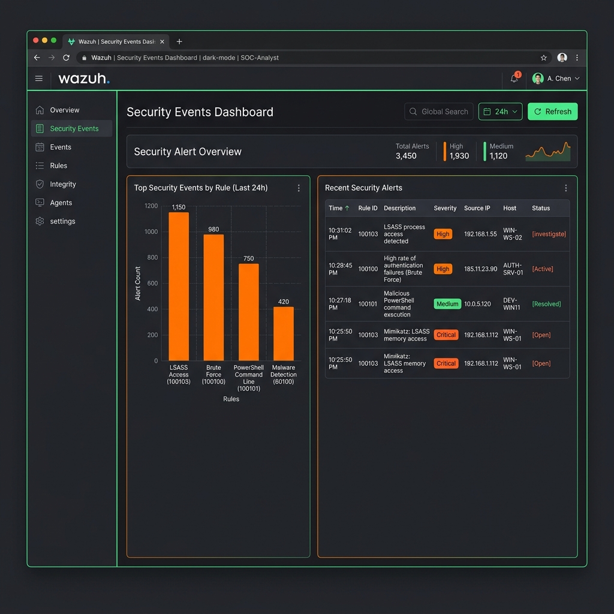
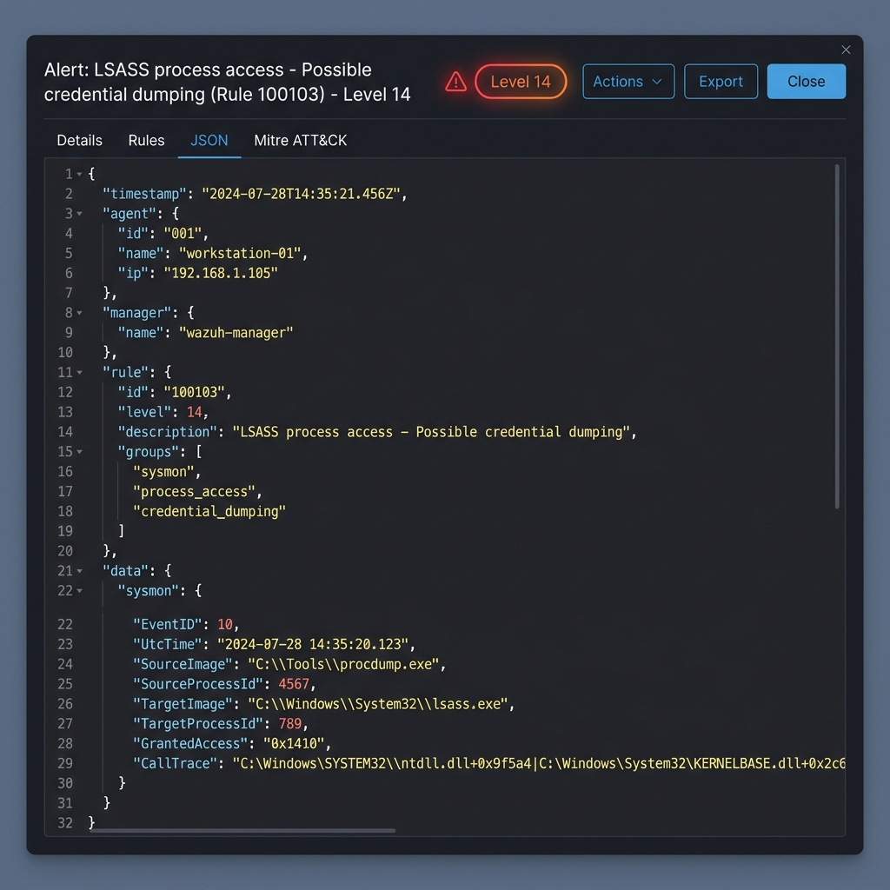
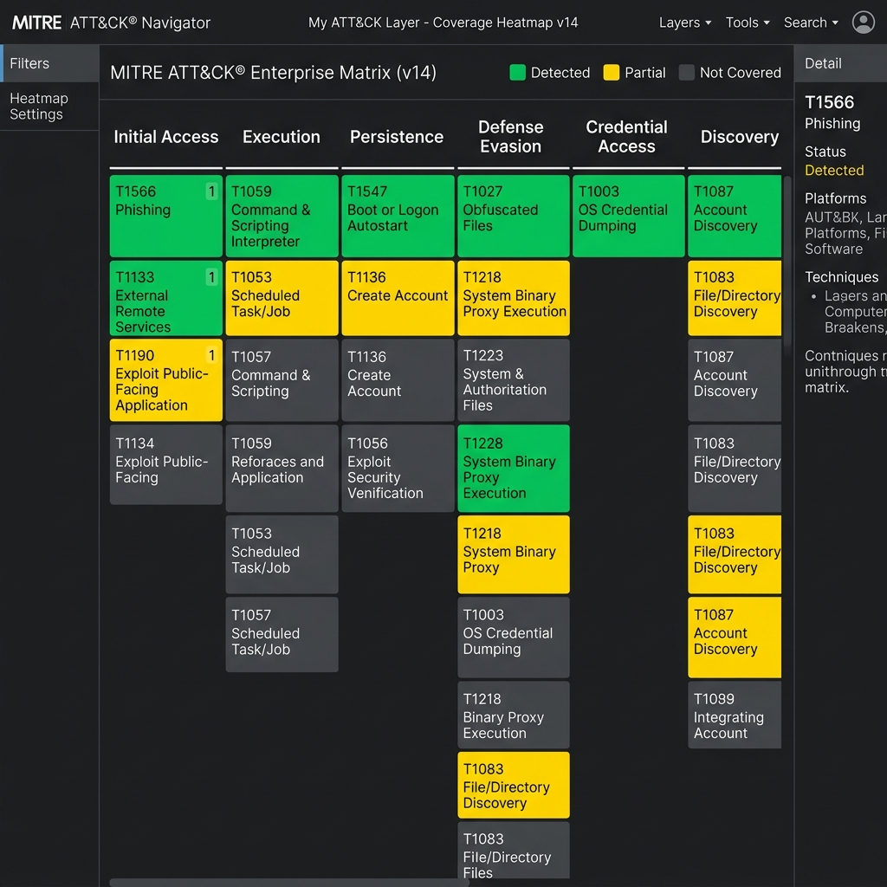

# Detection Engineering Lab

A hands-on cybersecurity portfolio demonstrating **detection engineering** skills through controlled attack simulation, custom rule development, MITRE ATT&CK mapping, and detection gap analysis.

Built for SOC analysts, detection engineers, and blue team professionals preparing for internships and entry-level security roles.

---

## Overview

This lab simulates real-world adversary behavior on a Windows 10 endpoint using [Atomic Red Team](https://github.com/redcanaryco/atomic-red-team), validates alerts in [Wazuh SIEM](https://wazuh.com/), and documents the full detection lifecycle—from hypothesis to rule tuning.

| Component | Role |
|-----------|------|
| **Wazuh Manager + Dashboard** | Central SIEM, rule engine, alert correlation |
| **Windows 10 Victim** | Wazuh agent, Sysmon, PowerShell logging |
| **Atomic Red Team** | Repeatable, ATT&CK-mapped attack simulations |
| **Sigma Rules** | Vendor-agnostic detection logic |
| **Custom Wazuh Rules** | Environment-specific tuning and enrichment |
| **Kali Linux (optional)** | Remote attack source for lateral movement tests |

---

## Lab Architecture



Full architecture details: [`docs/architecture.md`](docs/architecture.md)

---

## MITRE ATT&CK Coverage

| Technique ID | Name | Detection Status |
|--------------|------|------------------|
| [T1110](docs/attack-simulations/T1110-brute-force.md) | Brute Force | ✅ Detected |
| [T1059.001](docs/attack-simulations/T1059-powershell.md) | PowerShell | ✅ Detected |
| [T1547.001](docs/attack-simulations/T1547-persistence.md) | Boot or Logon Autostart Execution | ✅ Detected |
| [T1003.001](docs/attack-simulations/T1003-credential-dumping.md) | OS Credential Dumping (LSASS) | ✅ Detected |
| [T1021.001](docs/attack-simulations/T1021-remote-services.md) | Remote Desktop Protocol | ✅ Detected |
| [T1078.003](docs/attack-simulations/T1078-valid-accounts.md) | Valid Accounts (Local) | ⚠️ Partial |
| [T1105](docs/attack-simulations/T1105-ingress-tool-transfer.md) | Ingress Tool Transfer | ✅ Detected |
| [T1082](docs/attack-simulations/T1082-system-information-discovery.md) | System Information Discovery | ⚠️ Partial |
| [T1018](docs/attack-simulations/T1018-remote-system-discovery.md) | Remote System Discovery | ✅ Detected |
| [T1047](docs/attack-simulations/T1047-wmi.md) | Windows Management Instrumentation | ✅ Detected |
| [T1055.001](docs/attack-simulations/T1055-process-injection.md) | Process Injection (DLL) | ⚠️ Partial |
| [T1136.001](docs/attack-simulations/T1136-create-account.md) | Create Account (Local) | ✅ Detected |

Complete matrix: [`docs/mitre-attack-mapping.md`](docs/mitre-attack-mapping.md)

---

## Repository Structure

```
detection-engineering-lab/
├── README.md                          # Project overview (this file)
├── setup-lab.ps1                      # Windows endpoint setup automation script
├── sysmon-config.xml                  # Tailored Sysmon configuration XML
├── playbooks/
│   └── triage-playbook.md             # SOC Incident Response Playbook
├── docs/
│   ├── architecture.md                # Lab topology and data flow
│   ├── mitre-attack-mapping.md        # ATT&CK coverage matrix
│   ├── portfolio-guide.md             # How to present this project
│   ├── attack-simulations/            # Per-technique documentation (12)
│   └── templates/                     # Reusable documentation templates
├── screenshots/
│   └── checklist.md                   # Required evidence screenshots
├── custom-rules/
│   ├── local_rules.xml                # Upgraded Wazuh detection rules
│   └── README.md                      # Rule deployment guide
├── sigma-rules/                       # 12 Sigma rules (YAML)
├── atomic-red-team-tests/
│   └── test-mapping.md                # ART test ID reference
├── reports/
│   └── detection-gap-analysis.md      # Coverage gaps and recommendations
└── assets/
    └── .gitkeep
```

---

## Attack Simulations

All simulations were executed with Atomic Red Team on a Windows 10 victim with Wazuh agent installed.

```powershell
# Example: Run a single Atomic test
Invoke-AtomicTest T1003.001 -TestNumbers 1
```

| # | Technique | Atomic Test | Documentation |
|---|-----------|-------------|---------------|
| 1 | T1110 Brute Force | T1110.003 | [View](docs/attack-simulations/T1110-brute-force.md) |
| 2 | T1059.001 PowerShell | T1059.001 | [View](docs/attack-simulations/T1059-powershell.md) |
| 3 | T1547.001 Persistence | T1547.001 | [View](docs/attack-simulations/T1547-persistence.md) |
| 4 | T1003.001 Credential Dumping | T1003.001 | [View](docs/attack-simulations/T1003-credential-dumping.md) |
| 5 | T1021.001 Remote Services | T1021.001 | [View](docs/attack-simulations/T1021-remote-services.md) |
| 6 | T1078.003 Valid Accounts | T1078.003 | [View](docs/attack-simulations/T1078-valid-accounts.md) |
| 7 | T1105 Ingress Tool Transfer | T1105 | [View](docs/attack-simulations/T1105-ingress-tool-transfer.md) |
| 8 | T1082 System Info Discovery | T1082 | [View](docs/attack-simulations/T1082-system-information-discovery.md) |
| 9 | T1018 Remote System Discovery | T1018 | [View](docs/attack-simulations/T1018-remote-system-discovery.md) |
| 10 | T1047 WMI | T1047 | [View](docs/attack-simulations/T1047-wmi.md) |
| 11 | T1055.001 Process Injection | T1055.001 | [View](docs/attack-simulations/T1055-process-injection.md) |
| 12 | T1136.001 Create Account | T1136.001 | [View](docs/attack-simulations/T1136-create-account.md) |

ART test reference: [`atomic-red-team-tests/test-mapping.md`](atomic-red-team-tests/test-mapping.md)

---

## Detection Rules

### Sigma Rules

Vendor-agnostic detection logic in [`sigma-rules/`](sigma-rules/). Compatible with conversion to Wazuh, Splunk, Elastic, and other SIEMs via [Sigma CLI](https://github.com/SigmaHQ/sigma).

### Custom Wazuh Rules

Environment-tuned rules in [`custom-rules/local_rules.xml`](custom-rules/local_rules.xml). Deploy to:

```
/var/ossec/etc/rules/local_rules.xml
```

See [`custom-rules/README.md`](custom-rules/README.md) for installation steps.

---

## Key Findings

From [`reports/detection-gap-analysis.md`](reports/detection-gap-analysis.md):

- **9 of 12** techniques achieved reliable detection with default + custom rules
- **3 techniques** (T1078, T1082, T1055) require additional telemetry or tuning
- Primary gaps: PowerShell without script block logging, benign discovery noise, injection without Sysmon Event ID 8
- Recommended improvements: enable Script Block Logging, deploy Sysmon with SwiftOnSecurity config, add Windows Audit Policy baselines

---

## Automated Lab Setup & Telemetry Configuration

To simplify the deployment of required audit policies, logging facilities, and host telemetry, an automated script is provided.

Run the setup script in an elevated PowerShell session:
```powershell
Set-ExecutionPolicy Bypass -Scope Process -Force
.\setup-lab.ps1
```

This script automates:
1. **Administrative Rights Verification**
2. **Advanced Security Auditing**: Configures command-line auditing (Process Creation Event ID 4688), Logon Success/Failures, and User/Security Group Management.
3. **PowerShell Logging Configuration**: Enables Module Logging (Event ID 4103) and Script Block Logging (Event ID 4104) in the Registry.
4. **Sysmon Deployment**: Automatically downloads, extracts, and installs Microsoft Sysmon using the custom [`sysmon-config.xml`](sysmon-config.xml) configuration template.
5. **Wazuh Agent Health Check**: Verifies and starts the Wazuh Agent service if disabled.

---

## SOC Incident Response Playbooks

To bridge the gap between detection engineering and security operations, triage and incident response procedures are provided for SOC Analysts:
* [`playbooks/triage-playbook.md`](playbooks/triage-playbook.md) — Step-by-step containment, triage, and investigation workflows for LSASS Credential Dumping, Process Injection, and Brute Force attacks.

---

## Lab Prerequisites

| Requirement | Version / Notes |
|-------------|-----------------|
| Wazuh Manager | 4.x |
| Wazuh Agent | Installed on Windows 10 victim |
| Sysmon | Optional but recommended (process injection, LSASS) |
| PowerShell | 5.1+ with Module Logging enabled |
| Atomic Red Team | [Install guide](https://github.com/redcanaryco/invoke-atomicredteam) |
| Windows Audit Policy | Logon failures, account management, process creation |

---

## Skills Demonstrated

- MITRE ATT&CK technique mapping and threat modeling
- Atomic Red Team attack simulation and validation
- Sigma rule authoring and SIEM translation
- Wazuh custom rule development (XML)
- Windows event log analysis (Security, Sysmon, PowerShell)
- Detection gap analysis and remediation planning
- Security documentation and portfolio presentation

---

## Screenshots

Evidence checklist for portfolio and interview use: [`screenshots/checklist.md`](screenshots/checklist.md)

Place captured images in `screenshots/` using the naming convention defined in the checklist.

### Lab Evidence





---

## Documentation Templates

Reusable templates for extending the lab:

- [`docs/templates/attack-simulation-template.md`](docs/templates/attack-simulation-template.md)
- [`docs/templates/detection-rule-template.md`](docs/templates/detection-rule-template.md)
- [`docs/templates/incident-report-template.md`](docs/templates/incident-report-template.md)

---

## Portfolio Presentation

Guide for resumes, LinkedIn, and interviews: [`docs/portfolio-guide.md`](docs/portfolio-guide.md)

---

## Disclaimer

All attack simulations were performed in an **isolated lab environment** owned by the author. Techniques documented here are for **defensive security research and education only**. Do not execute Atomic Red Team tests against systems you do not own or have explicit authorization to test.

---

## Author

Detection Engineering Lab — Portfolio Project  
*Prepared for SOC / Detection Engineering / Blue Team roles*

---

## License

This project is provided for educational and portfolio purposes. Atomic Red Team tests are subject to [Red Canary's license](https://github.com/redcanaryco/atomic-red-team/blob/master/LICENSE.txt). Sigma rules follow the [Detection Rule License (DRL) 1.1](https://github.com/SigmaHQ/sigma/blob/master/LICENSE.Detection.Rules.md).
