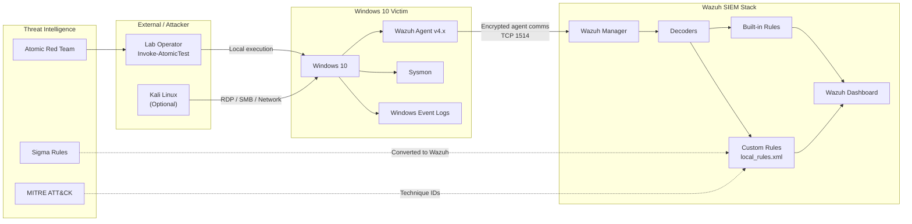
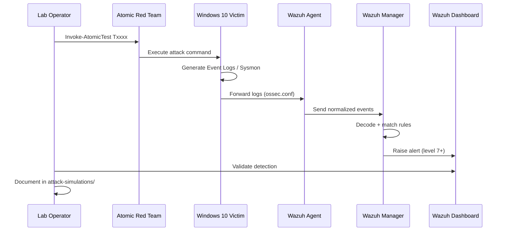
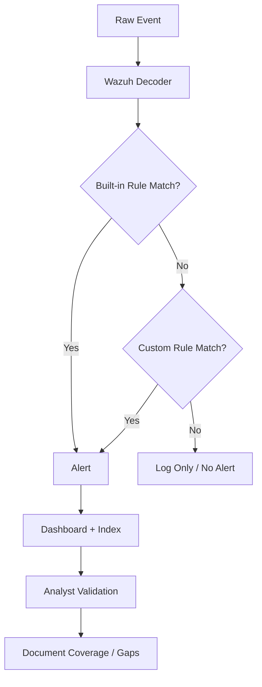

# Lab Architecture

## Overview

The Detection Engineering Lab is a three-zone architecture designed to simulate adversary activity, collect endpoint telemetry, and validate detection logic in a controlled environment.

---

## Architecture Diagram



---

## Data Flow



---

## Network Topology

| Host | IP (Example) | Role | Ports |
|------|--------------|------|-------|
| Wazuh Manager | 192.168.56.10 | SIEM, rule engine | 1514 (agent), 1515 (registration), 443 (dashboard) |
| Windows 10 Victim | 192.168.56.20 | Target endpoint | 3389 (RDP, if enabled) |
| Kali Linux | 192.168.56.30 | Optional remote attacker | — |

> **Note:** IP addresses are examples for VirtualBox/VMware host-only networks. Adjust to match your lab.

---

## Log Sources

| Source | Location | Events Used |
|--------|----------|-------------|
| Windows Security | `Security.evtx` | 4624, 4625, 4720, 4732, 4648 |
| Sysmon | `Microsoft-Windows-Sysmon/Operational` | 1, 3, 7, 8, 10, 11, 22 |
| PowerShell | `Microsoft-Windows-PowerShell/Operational` | 4103, 4104 |
| Windows System | `System.evtx` | 7045 (service install) |
| Wazuh Agent | `ossec.log` | Agent health, rule triggers |

### Wazuh Agent Configuration (excerpt)

```xml
<localfile>
  <location>Microsoft-Windows-Sysmon/Operational</location>
  <log_format>eventchannel</log_format>
</localfile>
<localfile>
  <location>Microsoft-Windows-PowerShell/Operational</location>
  <log_format>eventchannel</log_format>
</localfile>
```

---

## Detection Pipeline



---

## Component Responsibilities

### Wazuh Manager
- Receives events from agents
- Applies decoders to parse Windows Event Channel XML
- Evaluates built-in and custom rules
- Stores alerts for dashboard visualization

### Wazuh Agent (Windows)
- Collects configured log sources
- Ships events to manager over encrypted channel
- Runs active response (disabled in lab by default)

### Sysmon
- Provides process creation, network, and image load telemetry
- Critical for T1003 (LSASS access), T1055 (CreateRemoteThread), T1105 (file download context)

### Atomic Red Team
- Provides standardized test cases mapped to ATT&CK
- Ensures repeatable, documented attack execution

---

## Security Boundaries

- Lab VMs are isolated on a host-only virtual network
- No internet exposure for victim machine during simulations
- Snapshots taken before each simulation for rollback
- Custom Wazuh rules tested in staging before production use

---

## Related Documentation

- [MITRE ATT&CK Mapping](mitre-attack-mapping.md)
- [Detection Gap Analysis](../reports/detection-gap-analysis.md)
- [Attack Simulations](attack-simulations/)
- [Custom Rules README](../custom-rules/README.md)
