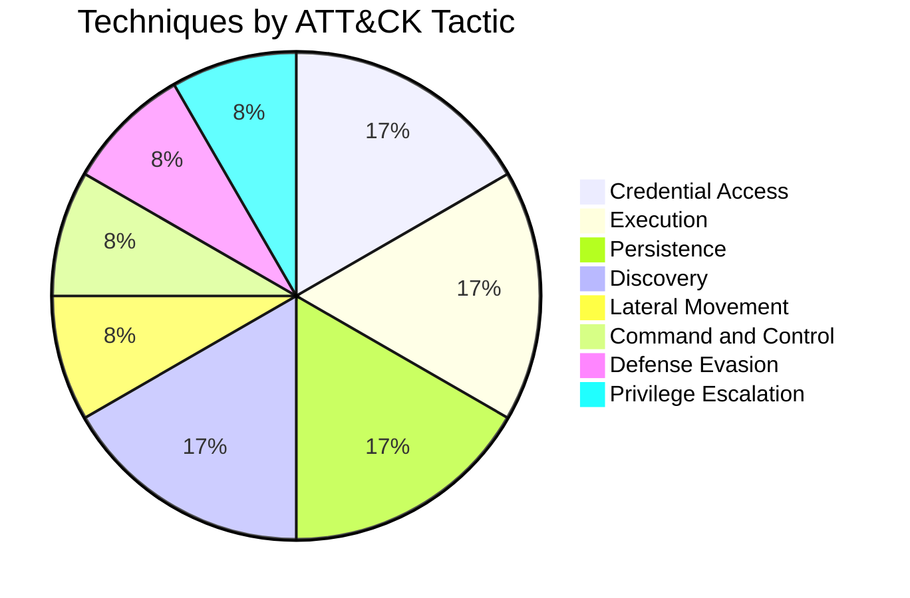

# MITRE ATT&CK Mapping Matrix

## Coverage Summary

| Metric | Value |
|--------|-------|
| Techniques Simulated | 12 |
| Tactics Covered | 8 |
| Full Detection | 9 |
| Partial Detection | 3 |
| No Detection | 0 |

---

## Mapping Matrix

| Technique ID | Technique Name | Tactic | Atomic Test | Sigma Rule | Wazuh Rule | Coverage | Documentation |
|--------------|----------------|--------|-------------|------------|------------|----------|---------------|
| T1110.003 | Password Spraying | Credential Access | T1110.003-1 | `sigma-rules/win_security_brute_force.yml` | `100100` | ✅ Full | [T1110](attack-simulations/T1110-brute-force.md) |
| T1059.001 | PowerShell | Execution | T1059.001-1 | `sigma-rules/win_powershell_suspicious.yml` | `100101` | ✅ Full | [T1059](attack-simulations/T1059-powershell.md) |
| T1547.001 | Registry Run Keys | Persistence | T1547.001-1 | `sigma-rules/win_registry_run_key_persistence.yml` | `100102` | ✅ Full | [T1547](attack-simulations/T1547-persistence.md) |
| T1003.001 | LSASS Memory | Credential Access | T1003.001-1 | `sigma-rules/win_lsass_access.yml` | `100103` | ✅ Full | [T1003](attack-simulations/T1003-credential-dumping.md) |
| T1021.001 | Remote Desktop Protocol | Lateral Movement | T1021.001-1 | `sigma-rules/win_rdp_logon.yml` | `100104` | ✅ Full | [T1021](attack-simulations/T1021-remote-services.md) |
| T1078.003 | Local Accounts | Defense Evasion, Persistence, Privilege Escalation, Initial Access | T1078.003-1 | `sigma-rules/win_valid_account_logon.yml` | `100105` | ⚠️ Partial | [T1078](attack-simulations/T1078-valid-accounts.md) |
| T1105 | Ingress Tool Transfer | Command and Control | T1105-1 | `sigma-rules/win_ingress_tool_transfer.yml` | `100106` | ✅ Full | [T1105](attack-simulations/T1105-ingress-tool-transfer.md) |
| T1082 | System Information Discovery | Discovery | T1082-1 | `sigma-rules/win_system_info_discovery.yml` | `100107` | ⚠️ Partial | [T1082](attack-simulations/T1082-system-information-discovery.md) |
| T1018 | Remote System Discovery | Discovery | T1018-1 | `sigma-rules/win_remote_system_discovery.yml` | `100108` | ✅ Full | [T1018](attack-simulations/T1018-remote-system-discovery.md) |
| T1047 | Windows Management Instrumentation | Execution | T1047-1 | `sigma-rules/win_wmi_execution.yml` | `100109` | ✅ Full | [T1047](attack-simulations/T1047-wmi.md) |
| T1055.001 | DLL Injection | Defense Evasion, Privilege Escalation | T1055.001-1 | `sigma-rules/win_process_injection.yml` | `100110` | ⚠️ Partial | [T1055](attack-simulations/T1055-process-injection.md) |
| T1136.001 | Local Account | Persistence | T1136.001-1 | `sigma-rules/win_account_creation.yml` | `100111` | ✅ Full | [T1136](attack-simulations/T1136-create-account.md) |

---

## Tactic Distribution



> Note: Several techniques map to multiple tactics; chart shows primary tactic used for simulation context.

---

## Detection Coverage Heatmap

| Tactic | Techniques | Full | Partial | None |
|--------|------------|------|---------|------|
| Credential Access | T1110, T1003 | 2 | 0 | 0 |
| Execution | T1059, T1047 | 2 | 0 | 0 |
| Persistence | T1547, T1136 | 2 | 0 | 0 |
| Discovery | T1082, T1018 | 1 | 1 | 0 |
| Lateral Movement | T1021 | 1 | 0 | 0 |
| Command and Control | T1105 | 1 | 0 | 0 |
| Defense Evasion | T1078, T1055 | 0 | 2 | 0 |

---

## ATT&CK Navigator Layer (Manual Import)

Use these technique IDs to build a Navigator layer for portfolio screenshots:

```
T1110.003, T1059.001, T1547.001, T1003.001, T1021.001, T1078.003,
T1105, T1082, T1018, T1047, T1055.001, T1136.001
```

**Color coding suggestion:**
- Green (#00ff00): Full detection (9 techniques)
- Yellow (#ffff00): Partial detection (T1078, T1082, T1055)
- Red (#ff0000): No detection (none in this lab)

---

## Data Sources Referenced

| ATT&CK Data Source | Techniques |
|--------------------|------------|
| Logon Session (Windows) | T1110, T1021, T1078 |
| Process Creation (Windows) | T1059, T1047, T1105, T1082, T1018, T1055 |
| PowerShell Logs (Windows) | T1059 |
| Windows Registry (Windows) | T1547 |
| Process Access (Windows) | T1003, T1055 |
| Network Traffic (Windows) | T1105, T1018, T1021 |
| User Account (Windows) | T1136, T1078 |
| WMI Objects (Windows) | T1047 |

---

## Related Files

- [Detection Gap Analysis](../reports/detection-gap-analysis.md)
- [Sigma Rules](../sigma-rules/)
- [Custom Wazuh Rules](../custom-rules/local_rules.xml)
- [Attack Simulations](attack-simulations/)
