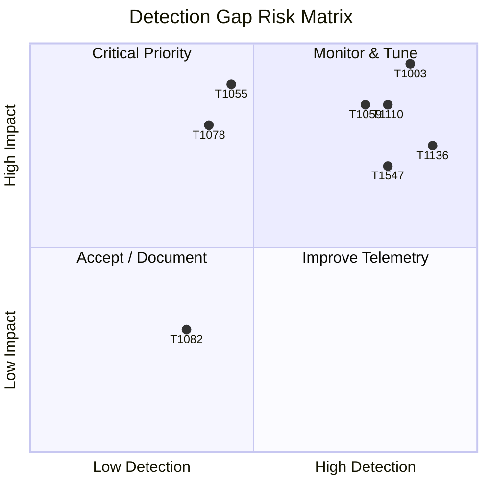

# Detection Gap Analysis

**Project:** Detection Engineering Lab  
**Date:** June 2025  
**Analyst:** Detection Engineering Lab (Portfolio)  
**Scope:** 12 MITRE ATT&CK techniques simulated via Atomic Red Team on Windows 10 with Wazuh SIEM

---

## Executive Summary

This analysis evaluates detection coverage across 12 ATT&CK techniques after executing Atomic Red Team simulations and validating alerts in Wazuh. **Nine techniques (75%)** achieved reliable detection with built-in and custom rules. **Three techniques (25%)** produced partial coverage requiring additional telemetry, tuning, or behavioral analytics.

Primary gaps stem from:
1. Insufficient PowerShell script block logging for obfuscated execution
2. High false-positive potential for benign discovery commands
3. Process injection detection dependency on Sysmon Event ID 8 configuration

---

## Coverage Overview

| Status | Count | Techniques |
|--------|-------|------------|
| ✅ Full Detection | 9 | T1110, T1059, T1547, T1003, T1021, T1105, T1018, T1047, T1136 |
| ⚠️ Partial Detection | 3 | T1078, T1082, T1055 |
| ❌ No Detection | 0 | — |

---

## Per-Technique Gap Analysis

### T1110 — Brute Force ✅ Full Coverage

| Aspect | Detail |
|--------|--------|
| **Gap** | Single-source IP lockout may miss distributed spraying |
| **Current Detection** | Event 4625 threshold rule (5 failures / 60s) |
| **Recommendation** | Add correlation across multiple target accounts; integrate VPN/firewall logs |

---

### T1059 — PowerShell ✅ Full Coverage

| Aspect | Detail |
|--------|--------|
| **Gap** | Encoded commands without Script Block Logging may evade |
| **Current Detection** | PowerShell 4104 + suspicious command-line patterns |
| **Recommendation** | Enforce Script Block Logging via GPO; deploy AMSI integration monitoring |

---

### T1547 — Persistence ✅ Full Coverage

| Aspect | Detail |
|--------|--------|
| **Gap** | User-level Run keys may blend with legitimate software |
| **Current Detection** | Registry modification to Run/RunOnce keys |
| **Recommendation** | Baseline known autoruns; alert on new unsigned entries |

---

### T1003 — Credential Dumping ✅ Full Coverage

| Aspect | Detail |
|--------|--------|
| **Gap** | MiniDump via comsvcs.dll may not trigger LSASS access rule |
| **Current Detection** | Sysmon Event 10 — LSASS process access |
| **Recommendation** | Add rule for `rundll32 comsvcs.dll MiniDump`; monitor for handle duplication |

---

### T1021 — Remote Services ✅ Full Coverage

| Aspect | Detail |
|--------|--------|
| **Gap** | Legitimate admin RDP sessions create noise |
| **Current Detection** | Event 4624 Logon Type 10 from non-admin subnets |
| **Recommendation** | Geo-IP filtering; time-based access policies; jump server architecture |

---

### T1078 — Valid Accounts ⚠️ Partial Coverage

| Aspect | Detail |
|--------|--------|
| **Gap** | Legitimate local account logon is indistinguishable from abuse without context |
| **Current Detection** | Logon success after account creation; off-hours logon (tuned) |
| **Why Partial** | Atomic test uses existing valid credentials — no unique IOC without enrichment |
| **Recommendation** | UEBA for anomalous logon patterns; monitor service account interactive logons; implement MFA |

---

### T1105 — Ingress Tool Transfer ✅ Full Coverage

| Aspect | Detail |
|--------|--------|
| **Gap** | HTTPS downloads to trusted domains may bypass |
| **Current Detection** | certutil.exe, bitsadmin, Invoke-WebRequest patterns |
| **Recommendation** | SSL inspection where permitted; monitor for executables written to TEMP |

---

### T1082 — System Information Discovery ⚠️ Partial Coverage

| Aspect | Detail |
|--------|--------|
| **Gap** | `systeminfo`, `hostname`, `whoami` are used daily by admins and scripts |
| **Current Detection** | Recon command chain detection (multiple discovery commands in short window) |
| **Why Partial** | Single-command execution does not alert to reduce noise |
| **Recommendation** | Correlate discovery commands with subsequent credential access or lateral movement |

---

### T1018 — Remote System Discovery ✅ Full Coverage

| Aspect | Detail |
|--------|--------|
| **Gap** | `nltest` and `net view` may be used by IT tooling |
| **Current Detection** | Remote enumeration via `net view`, `nslookup`, `ping` sweep patterns |
| **Recommendation** | Allowlist domain controllers and management servers |

---

### T1047 — WMI ✅ Full Coverage

| Aspect | Detail |
|--------|--------|
| **Gap** | WMI used legitimately by SCCM and monitoring tools |
| **Current Detection** | `wmic process call create` and suspicious `Invoke-WmiMethod` |
| **Recommendation** | Baseline WMI consumers; restrict WMI permissions via GPO |

---

### T1055 — Process Injection ⚠️ Partial Coverage

| Aspect | Detail |
|--------|--------|
| **Gap** | Without Sysmon Event ID 8, CreateRemoteThread is not logged |
| **Current Detection** | Sysmon Event 8 — CreateRemoteThread (when enabled) |
| **Why Partial** | Default Sysmon config may exclude Event 8; some injection methods use APC or process hollowing |
| **Recommendation** | Enable Sysmon Event 8; deploy EDR with kernel callbacks; monitor for unsigned DLL loads (Event 7) |

---

### T1136 — Create Account ✅ Full Coverage

| Aspect | Detail |
|--------|--------|
| **Gap** | Temporary lab accounts may not trigger if naming matches service accounts |
| **Current Detection** | Event 4720 local account creation |
| **Recommendation** | Alert on accounts added to Administrators group (Event 4732) within 24h of creation |

---

## Telemetry Gaps

| Missing / Incomplete Telemetry | Impact | Priority |
|-------------------------------|--------|----------|
| PowerShell Script Block Logging (4104) | Misses encoded/obfuscated T1059 | High |
| Sysmon Event ID 8 (CreateRemoteThread) | Reduces T1055 coverage | High |
| Windows Audit Policy — Process Creation | Limits T1105, T1082 context | Medium |
| Network flow logs (firewall) | Cannot correlate T1105 C2 | Medium |
| Command-line auditing (4688) | Enriches all process-based detections | High |

---

## Rule Quality Assessment

| Rule Category | Strengths | Weaknesses |
|---------------|-----------|------------|
| Built-in Wazuh | Good Windows Security coverage (logon, account) | Generic; high false positives |
| Custom Wazuh | Tuned to lab environment; ATT&CK tagged | Requires maintenance per OS update |
| Sigma | Portable; peer-reviewable | Needs conversion and field mapping per SIEM |

---

## Remediation Roadmap

### Phase 1 — Immediate (Week 1)
- [ ] Enable PowerShell Script Block Logging via GPO
- [ ] Deploy Sysmon with SwiftOnSecurity config including Event 8
- [ ] Enable Advanced Audit Policy: Logon, Account Management, Process Creation

### Phase 2 — Short Term (Week 2–4)
- [ ] Tune T1082 rule to fire on discovery command chains (3+ commands / 5 min)
- [ ] Add UEBA-style correlation for T1078 off-hours interactive logons
- [ ] Create allowlists for IT admin workstations (RDP, WMI)

### Phase 3 — Medium Term (Month 2+)
- [ ] Integrate threat intelligence feeds for known attack tools
- [ ] Build ATT&CK Navigator layers for quarterly coverage reviews
- [ ] Expand lab to Linux endpoints (Syslog, auditd)

---

## Risk Matrix

---

## Conclusion

The lab demonstrates a solid foundation in detection engineering with **75% full coverage** across simulated techniques. Remaining gaps are representative of real SOC challenges: distinguishing adversary behavior from legitimate administration, telemetry blind spots, and the need for correlation over single-event rules.

Continued improvement should focus on **telemetry enrichment** (Sysmon, PowerShell logging) and **behavioral correlation** rather than additional atomic IOC rules.

---

## References

- [MITRE ATT&CK Mapping](../docs/mitre-attack-mapping.md)
- [Attack Simulations](../docs/attack-simulations/)
- [Custom Wazuh Rules](../custom-rules/local_rules.xml)
- [Sigma Rules](../sigma-rules/)
